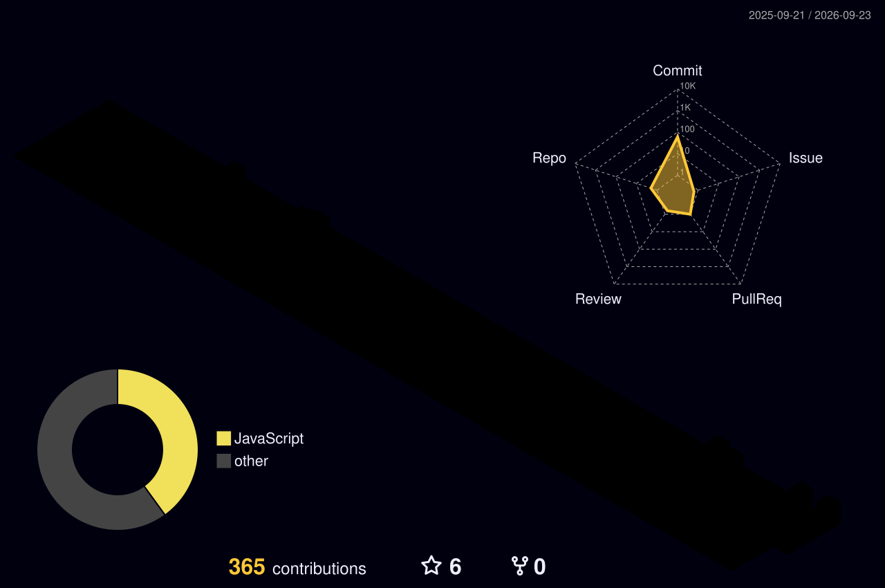

<!-- ===================== Amir Baradaran — Profile README ===================== -->

<div align="center">
  
</div>

<br/>

<div align="center">
  
</div>

<br/>

<div align="center">
  
  &nbsp;
  
</div>


##  About Me

<div align="center">

|  |  |  |  |
|:---:|:---:|:---:|:---:|
| **Amir Baradaran** | **Developer** | **UI / UX** | **Based in Iran** |

</div>

<br/>

```js
const amir = {
  name: "Amir Baradaran",
  role: "Front-end Developer & UI/UX Designer",
  stack: ["React", "Next.js", "TypeScript", "Node.js"],
  focus: ["Clean UI", "Performance", "Great UX"],
  learning: ["Advanced React Patterns", "Web Performance"],
  funFact: "I turn coffee into interfaces ☕ → ✨",
};
```

<p align="center">
  
  I craft <b>beautiful</b>, <b>fast</b>, and <b>delightful</b> web experiences.
  
</p>

---

##  Connect With Me

<div align="center">

[](https://www.linkedin.com/in/amirmohamad-baradaran-6b5a45328)
[](mailto:baradaran13085@gmail.com)
[](https://t.me/thatamir051)
[](https://github.com/AmirBradaran)

</div>

---

##  Tech Arsenal

<p align="center">
  <b>Frontend</b><br/>
  
</p>

<p align="center">
  <b>Styling & Design</b><br/>
  
</p>

<p align="center">
  <b>Backend & Tools</b><br/>
  
</p>

---

##  GitHub Analytics

<div align="center">
  
  
</div>

<br/>

<div align="center">
  
</div>

<br/>

<div align="center">
  
</div>

<br/>

<div align="center">
  
</div>

---

##  3D Contribution Graph

<!-- Auto-generated by GitHub Action after first run -->
<div align="center">
  
</div>

---

##  Contribution Snake

<!-- Auto-generated by GitHub Action after first run -->
<div align="center">
  <picture>
    <source media="(prefers-color-scheme: dark)" srcset="./output/github-contribution-grid-snake-dark.svg" />
    <source media="(prefers-color-scheme: light)" srcset="./output/github-contribution-grid-snake.svg" />
    
  </picture>
</div>

---

##  Currently Building

<div align="center">

|  |  |  |  |
|:---:|:---:|:---:|:---:|
| Modern React apps | Polished UI/UX | Performance & a11y | Advanced patterns |

</div>

---

##  Daily Inspiration

<div align="center">
  
</div>


<div align="center">
  
  <br/><br/>
  <b>✦ Designed & coded by <a href="https://github.com/AmirBradaran">AmirBradaran</a></b>
</div>
